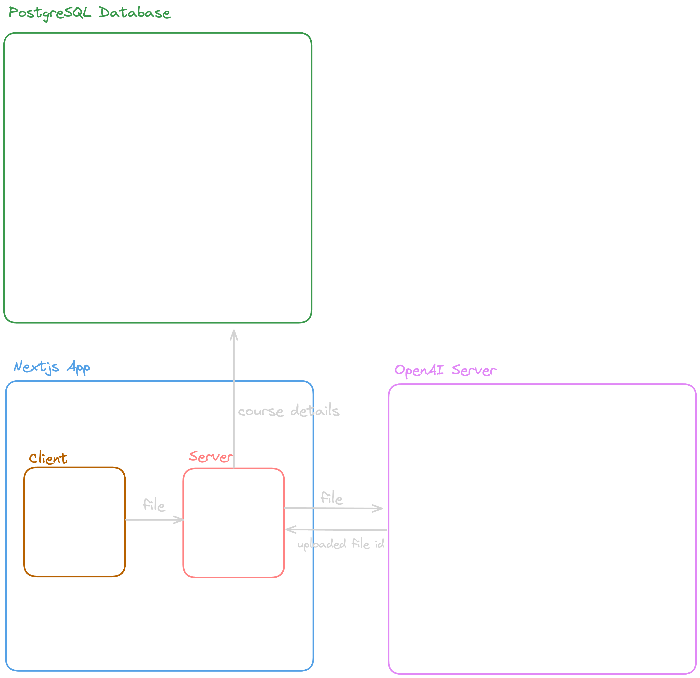










## Introduction
In my latest project, [fourgpa.com](https://fourgpa.com), I needed to upload large PDF files to the OpenAI Files API for later reference and PDF processing. Everything worked perfectly in my local environment, even files up to the 30MB limit set by OpenAI.

But as soon as I deployed the app to Vercel, things started breaking - even with files as small as 5MB!

After some debugging, I finally tracked down the root cause of the issue and found a quick workaround.  

Here is how I fixed it.

## Problem Definition
I was transferring the file uploaded on the client to the server, and then uploading it to OpenAI using Server Actions. This setup worked fine locally after I updated my `next.config.ts` to allow a higher body size.

However, once I deployed it to Vercel, things broke. Vercel has a [request body size limit](https://vercel.com/docs/functions/limitations#request-body-size) of 4.5MB for serverless functions, and I started getting the funny `413: FUNCTION_PAYLOAD_TOO_LARGE` error.

Here's what my original workflow looked like:

But this has some fatal issues:

1. Uploading files on the server is expensive - especially on serverless platforms :D
2. The file was being uploaded **twice**: once to my server and again to OpenAI  
3. Files larger than **4.5MB** hit Vercel's body size limit, causing a `413: FUNCTION_PAYLOAD_TOO_LARGE` error  

### So… how did I solve this?
I had to do the uploading on the client so it's free for my servers :). I couldn't upload directly to OpenAI from the client since it requires your secret key, so the only option left was using a middleman for file uploads.

Vercel Blob is a great option for this, but since I was already using Supabase S3, I just used it as cache storage and provided a calculated link as a parameter for server-side uploading to OpenAI. 

But with this approach, since we are uploading from the client, we need to consider security. That's where **signed URLs** come in.

So here is what it looks like:
1. Client → Server: Can I upload to documents/file.pdf?
   Server → Client: Here's a signed URL (expires in 15min)
2. Client → S3: Upload file using signed URL
   S3 → Client: Upload successful
3. Client → Server: What's the public URL for documents/file.pdf?
   Server → Client: Here's the public URL: https://...
4. Client → Server: "Process this file at public URL: https://..."
   Server: Downloads from public URL → Processes (sends to OpenAI) → Saves to DB

## Conclusion
Probably this is not the best way to do all of this, but this solution was cheap and fast for me to implement :D. Maybe things would have been easier if I had an **actual** server instead of these limited serverless functions.  

I get that serverless can be perfect for scalability, but my user count is literally 0 right now :). When I eventually have some users, paying for a small server to scale vertically won't be a problem.

Maybe the real question is: *What are we even optimizing for in the first place?*




