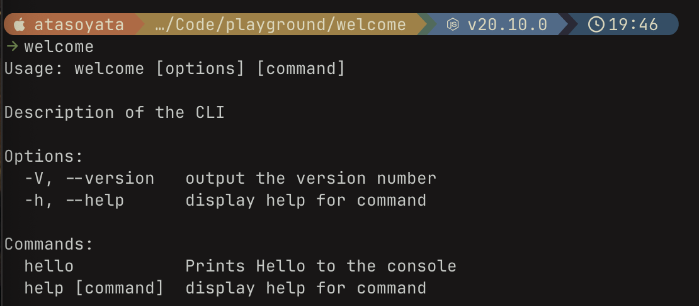
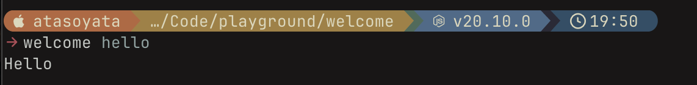
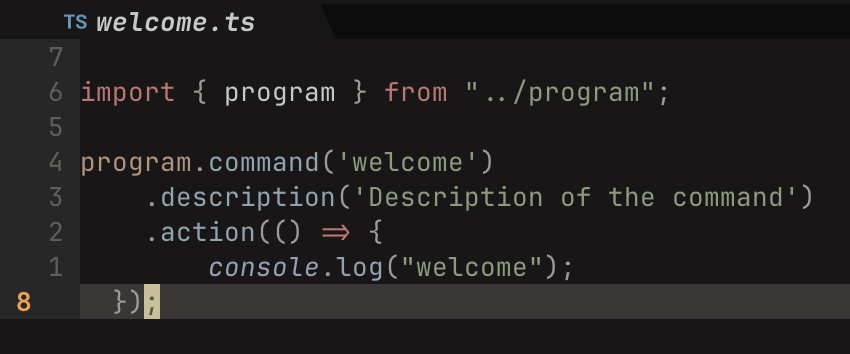
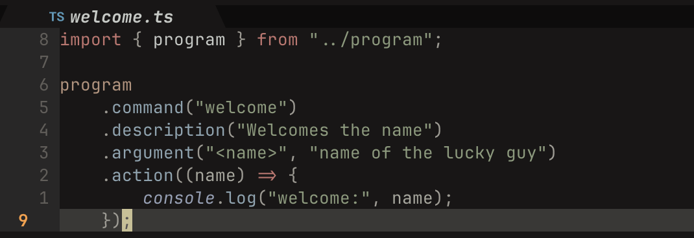
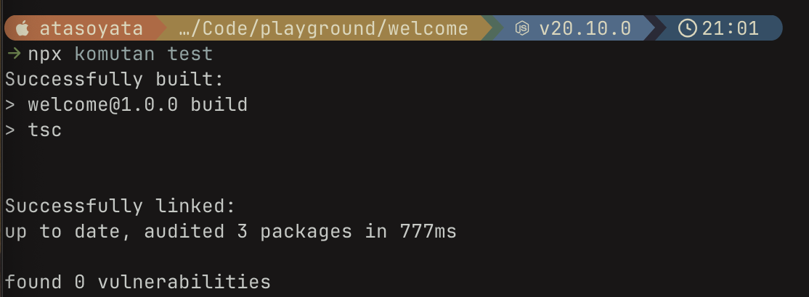










## Introduction
I was playing with CLI tools and thought it would be cool to make one and publish it. While I was searching for tech to use, I saw cobra and cobra-cli in Go, which is absolutely perfect. After playing with it for some time, I decided to make CLI tools also in TypeScript, but I had a hard time finding good resources, so here we are with [komutan](https://github.com/atasoya/komutan).

## What is Komutan?

Komutan is a CLI toolkit on top of [commanderjs](https://www.npmjs.com/package/commander) that streamlines the process of creating, developing, testing, and publishing CLI apps.

## Getting Started

Make sure that you have node and npm on your system, and then you can just install komutan with a simple command:

```bash
npx komutan
```

## Tutorial

In this tutorial, let's create a simple CLI tool that welcomes a given name. Let's create a new directory:

```bash
mkdir welcome
cd welcome
```

After making sure that you are in the welcome directory, run the `komutan init <name>` command:

```bash
npx komutan init welcome
```
 
This will scaffold your CLI app. You can see the project tree on GitHub.


Now let's test our CLI:

```bash
npx komutan test # you may need to add sudo
welcome
```



By default, you will have a hello command. Let's try that:



Perfect! Everything is working. Now let's add a welcome command and modify it.

You can add a new command by using the `komutan add <name>` command:

```bash
npx komutan add welcome
```


Now let's make it accept a name:



Run the test command again:



And now use it:



Here it is - everything is working fine!

Now the last step: you will probably want to publish your CLI, and it is as easy as running:

```bash
npx komutan publish # you may need to use sudo
```

## Conclusion
Done! You now know how to ship CLI apps like crazy.




