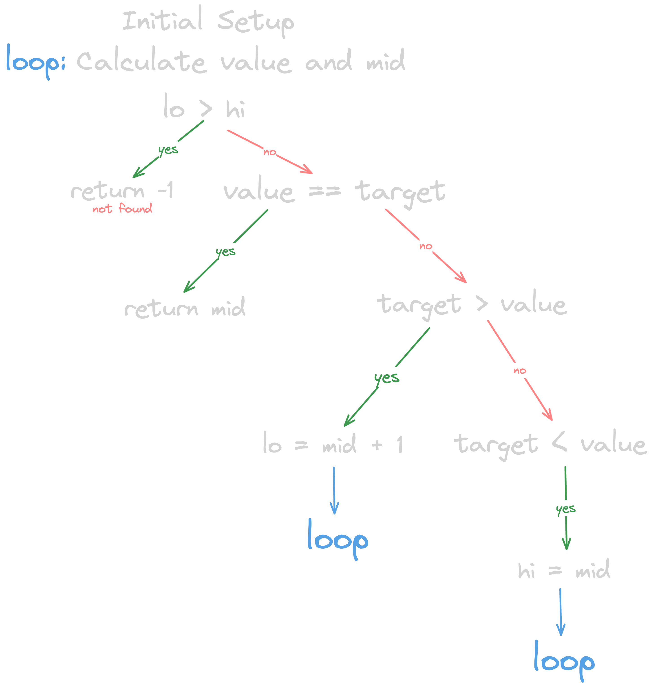
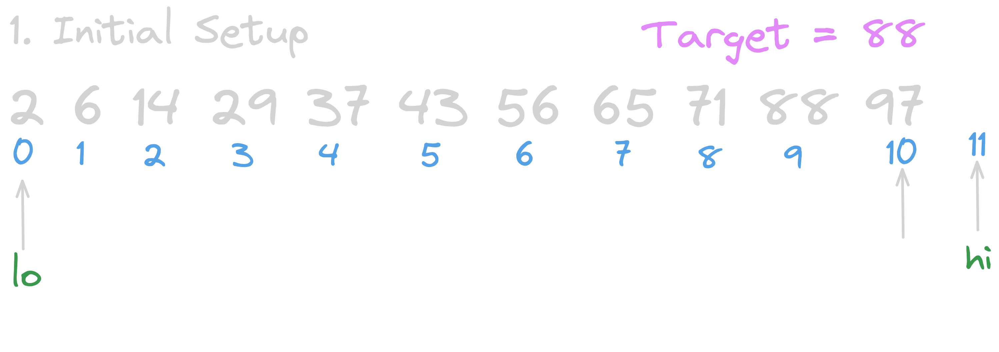
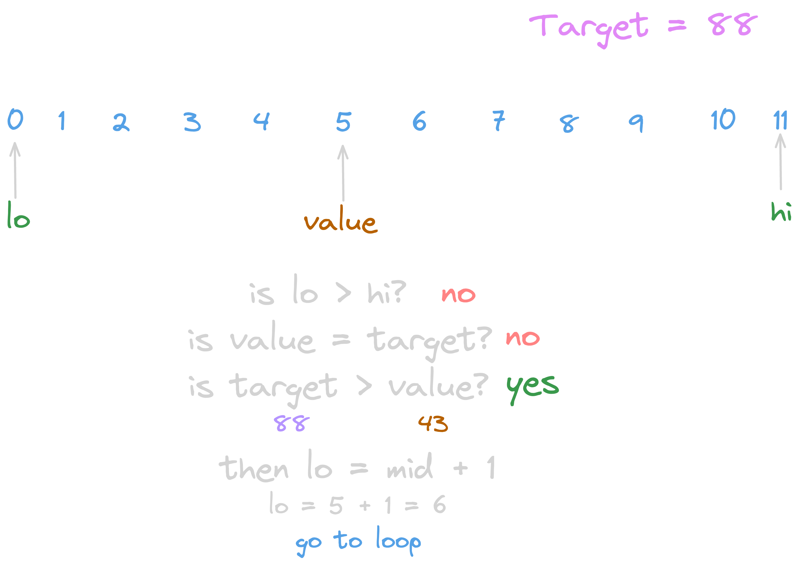










## Introduction
Binary search is one of the fundamental sorting algorithms and a building block for more complex ones. It can be tricky to understand at first, as most of us just learn it for the sake of some college assignment. But i believe that to truly master our craft, we need a bit more than that.

I remember my high school days when we learned binary search and I was really good at it. But honestly, I was only good at memorizing where to put the `-1` and `+1`, I didn’t actually understand anything :D

So, it’s time to change that. Let’s start!
## Understanding the Search Range
There are two different methods for binary search. One includes both `lo` and `hi` in the search scope, denoted as `[lo, hi]`. As we learned in calculus, this means both `lo` and `hi` are included in the range.

The other method, which I will cover now, is `[lo, hi)`. This means `lo` is included but `hi` is not. It is effectively the same as `[lo, hi - 1]`, but writing `-1` everywhere is a bit of a hassle, so we simply denote it as `[lo, hi)`.

Each method requires a different loop condition and range handling. In my opinion, `[lo, hi)` makes more sense as it works nicely with length functions in most programming languages. For example, if the last index is 9, the length is 10, so index 10 won’t be included. This pairs well with how length based loops typically work!

## Overview


It is actually a very simple and short algorithm, with just one loop and a few `if` conditions. Without wasting too much time, let's move on to the algorithm.

## Initial Setup


To begin with, I’ve created a sample array: ```array = [2,6,14,29,37,43,56,65,71,88,97]``` and we have ```target = 88```.
As the name suggests, we’ll divide the array in half each time the middle element is not our target.  ==Don’t forget that binary search assumes the array is already sorted.==

So, `lo` (lower bound) is `0` when we start that part is pretty straightforward.  
`hi` (higher bound) is set to the length of the array, but notice that it doesn't point to any actual value in the array.

\*Recall that we are using the `[lo, hi)` range as our search scope, which makes even more sense now when we visualize it!


## Mid Point Formula
$mid = lo + \text{floor}\left(\dfrac{hi - lo}{2}\right)$

Don’t be scared of this formula — it’s actually pretty straightforward.  
You’ll understand it better as we use it in the sample algorithm.  

Just make sure not to forget the `floor` function, since sometimes we need to get the lower bound when the result is not a whole number.


# Calculate Value & Mid 

Simply apply our formula to get the midpoint and the value to compare.



When the target is larger than our calculated value, it means the target is located above the midpoint. So, we update our search space to `[mid + 1, hi)`.

The `+1` logic is actually pretty simple!  Since we already checked if `array[mid]` is equal to the target, and it wasn't, we know the target can't be at `mid`. Therefore, we don't include it in the next search scope.


# Enter the Loop


calculate again

Now it's our first time encountering `target < value`.  
If the target is smaller than the value at `mid`, it means the target is located below the midpoint.  
So, we set our new `hi` as the midpoint.

A common question that arises is: why don't we use `-1` or `+1` here?

Well, we already know that `array[mid]` is not our target.  
And remember  our scope is `[lo, hi)`, which means `hi` is **not included** in the search range.  
So when we do `hi = mid`, it automatically excludes the current `mid`, but still includes `mid - 1` and everything before it.

**SIMPLE!**
# And Finally 


:))) Now, `value === target`, which means we've found the target, and we can return its index!

We usually return `-1` if the number is **not** in the array.  
This can be determined if the condition `lo >= hi` becomes true meaning our search space is empty.

## Running Time
**Quick answer:** O(log n)  
(based on logarithm with base 2)

But let’s prove it :))

Let’s say we have `n` elements in the array.

| Step | Elements Remaining |
|------|---------------------|
| 1    | n                   |
| 2    | n / 2               |
| 3    | n / 4               |
| 4    | n / 8               |
| ...  | ...                 |
| k    | n / 2^k             |

In the worst case, the algorithm stops when there’s only **1 element** left in the search range.  
So how many times can we divide the array in half until we reach 1?

We set up the equation:
n / 2^k = 1   => 2^k = n   => k = log(n)

So, the worst-case time complexity of binary search is: **O(log n)**

# Your Turn
.png)

Here is my Python solution for you to double check your understanding.  
But I **highly recommend** you write it yourself  even if you think you understand everything well.

Here's the LeetCode link for practice:  [Binary Search – LeetCode](https://leetcode.com/problems/binary-search/)

Thanks for reading all the way through! Feel free to reach out if you found this helpful :D





